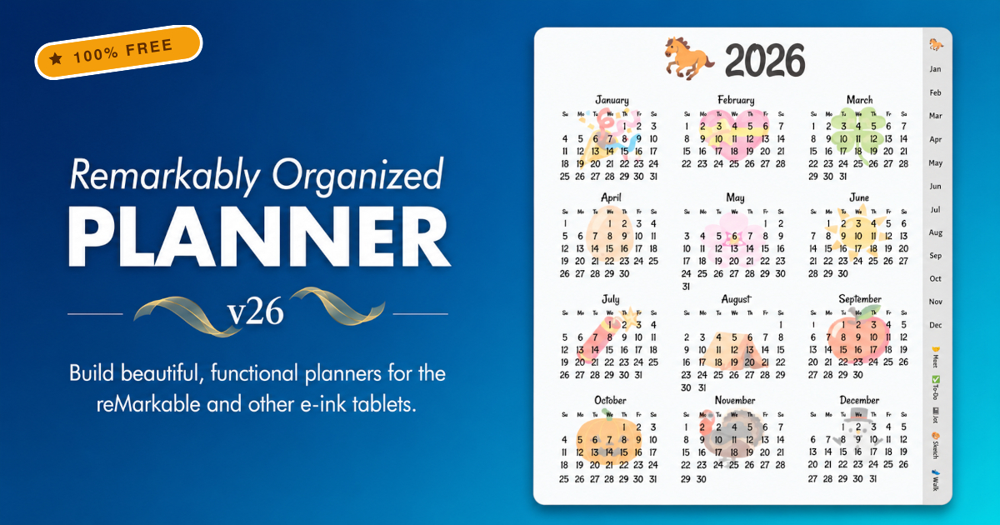

[](https://www.buymeacoffee.com/youmeos)

# Remarkably Organized Planner




🔗 **Live:** [planner.mycompassconsulting.com](https://planner.mycompassconsulting.com/)

A highly-customizable web app for generating premium hyperlinked PDF planners designed specifically for e-ink tablets like the reMarkable, Boox, Supernote, and Kindle Scribe.

Use the built-in design panel to tweak your planner's content, layout, and visual aesthetic. The PDF preview is generated live in your browser!

## 🌟 Key Features

- **Premium Theming:** Choose from curated design aesthetics (like _Midnight Nerd_, _Pastel Dreams_, or _Classic E-Ink_). Customize fonts, text colors, grid line colors, and background shading.
- **1-Click Presets:** Instantly load highly-optimized configurations tailored for different lifestyles:
  - _Software Engineer:_ Agile Sprint boards & daily standup notes.
  - _Health & Fitness:_ Weekly meal planners & dedicated workout logs.
  - _The Student & Educator:_ Semester-based tracking and curriculum planning for academic life.
  - _Sketch Journal:_ Pure dot-grid layouts with extensive custom collections.
  - _ADHD Focus:_ Clutter-free layouts with extra-large fonts.
- **Modular Collections:** Add up to 5 custom notebook sections to the back of your planner with features like auto-generated index pages and specialized templates (Finance Trackers, Meeting Minutes, Agile Boards, etc.).
- **Shareable Configurations:** Your entire planner configuration is encoded directly into the URL! Once you design your perfect planner, just copy the link to save it or share it with others.
- **Live Analytics:** See real-time community usage stats (total visitors, planners created, PDFs exported, and total time spent designing) right on the landing page!

## 🏆 Community Reception

We are incredibly grateful for the amazing response from the e-ink community! Recently featured as the **#1 Post on r/RemarkableTablet**, the launch of Remarkably Organized v26 achieved:

- **20,000+ Views** in the first 24 hours
- **98.5% Upvote Ratio**
- **100+ Shares**

[Read the community's feedback and join the discussion on Reddit!](https://www.reddit.com/r/RemarkableTablet/comments/1tup11a/i_updated_the_free_planner_builder_remarkably/)

## Exporting to PDF

To export your custom planner, use Chrome's built-in print-to-pdf functionality (`Ctrl/Cmd + P`).
**CRITICAL:** Make sure **"Background Graphics"** is enabled in the print settings so your themes and background colors render correctly.

If you generate a massive planner (e.g., 900+ pages), Chrome may require a moment to process the PDF.


## Development

The web app is built using **SvelteKit** and **Vite**.

Install dependencies using `pnpm`:

```bash
pnpm i
pnpm run dev
```

This will launch the dev server at `localhost:5173` with automatic Hot Module Replacement (HMR).

To build for production:

```bash
pnpm run build
```
